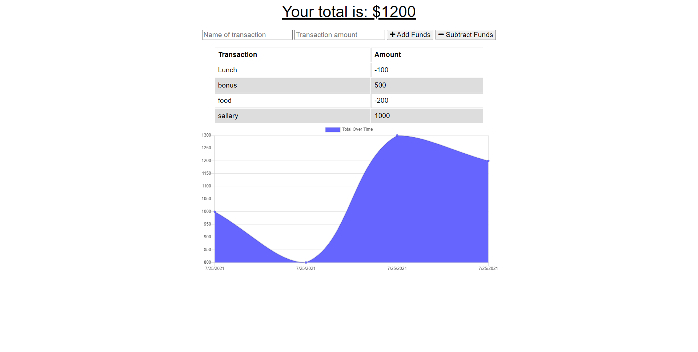

## Progressive Web Applications (PWA): Budget Tracker

### Description

_Giving users a fast and easy way to track their money is important, but allowing them to access that information at any time is even more important. Having offline functionality is paramount to the success of an application that handles users’ financial information_

## Table of Contents

- [Deployed Website:](#deployed-website)
- [Installation](#installation)
    - [Application Functionalities](#application-functionalities)
    - [User Story](#user-story)
- [Contribution](#contribution)
- [Questions](#questions)

### App Screenshot



# Deployed Website:

Click [here] (https://tranquil-anchorage-01057.herokuapp.com/) to view project.

# Installation

1. Clone this repository to your local machine.

2. Run `npm install` to install dependencies required for this project.

3. Run `npm run start` to start the application.

### Application Functionalities

- The ability to enter deposits offline.
- The ability to enter expenses offline.
- Offline entries should be added to the tracker when the application is brought back online

### User Story

```text
AS AN avid traveler
I WANT to be able to track my withdrawals and deposits with or without a data/internet connection
SO THAT my account balance is accurate when I am traveling
```

# Contribution

Please let me know how I can improve this project. Issues and pull requests are always welcome.

# Questions

If you have any questions about the repo,
contact me directly at [Email](mailto:hakelcam@gmail.com).
